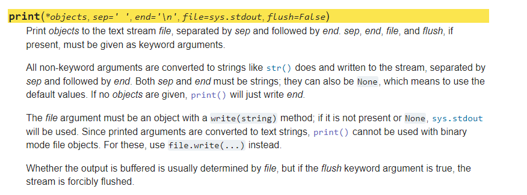

<!-- .slide:data-background="#000000" -->
# Python Fundamentals
---
# Recognize Python (Optional)
---
# Python Syntax
--
## Indentation and Line-Endings

---
# Data Types
--
>Everything in Python is an object.
--
What is an object?
--
>An object is an instance of a class.
--
## Primitive and Composite data types
--
### Primitive Types
#### Booleans  <!-- .element: class="fragment fade-in" -->
#### Numbers  <!-- .element: class="fragment fade-in" -->
#### Strings  <!-- .element: class="fragment fade-in" -->
#### None  <!-- .element: class="fragment fade-in" -->
--
### Composite Types
#### Lists  <!-- .element: class="fragment fade-in" -->
#### Tuples  <!-- .element: class="fragment fade-in" -->
#### Dictionaries  <!-- .element: class="fragment fade-in" -->
---
# Booleans
--
> Assesses the truth value of something

```py
is_logged_in = True
is_valid_email = False
```
 <!-- .element: class="fragment fade-in" -->
---
# Numbers
--
Integers and floats(i.e. decimals)

```py
age = 35 # storing an int
weight = 160.57 # storing a float
```
<!-- .element: class="fragment fade-in" -->
---
# Strings
--
> Strings are any sequence of characters (letters, numerals, ~($/}\#, etc.) enclosed in single or double quotes.

```py
name = "Joe Blue"
```
<!-- .element: class="fragment fade-in" -->
--
## Concatenating Strings and Variables

### With the built-in "print" function <!-- .element: class="fragment fade-in" -->


<!-- .element: class="fragment fade-in" -->
--
## With String Interpolation
### F-String (Literal String Interpolation) <!-- .element: class="fragment fade-in" -->
### `string.format()`  <!-- .element: class="fragment fade-in" -->
### %-formatting  <!-- .element: class="fragment fade-in" -->
--
### F-String (Literal String Interpolation)

```py
first_name = "Zen"
last_name = "Coder"
age = 27
print(f"My name is {first_name} {last_name} and I am {age} years old.")
## => My name is Zen Coder and I am 27 years old.
```
<!-- .element: class="stretch" -->
--
### `string.format()`

```py
first_name = "Zen"
last_name = "Coder"
age = 27
print(f"My name is {} {} and I am {} years old.".format(first_name, last_name, age))
## => My name is Zen Coder and I am 27 years old.
```
<!-- .element: class="stretch" -->
--
### %-formatting

```py
first_name = "Zen"
last_name = "Coder"
age = 27
print(f"My name is %s %s and I am %d years old." % (first_name, last_name, age))
## => My name is Zen Coder and I am 27 years old.
```
---
# None
--
# None
```py
nothing = None
```
--
---
<!-- .slide:data-background="#000000" -->
# Composite
---
# Lists
---
# Tuples
---
# Hello World (Practice)
---
# Dictionaries
---
# Conditionals
---
# Loops
---
# For Loop Basic I (Core)
---
# Functions
---
# Default Parameters & Named Arguments
---
# Debugging
---
# Functions Basic I (Practice)
---
# Functions Basic II (Practice)
---
# Functions Intermediate I (Core)