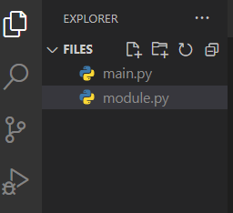

# Modules and Packages
--
# What is a module?
## any Python file    <!-- .element: class="fragment fade-in" -->
--
# What is a package? 
## a directory containing one or more Python modules.    <!-- .element: class="fragment fade-in" -->
--
## Batteries Included
[The Python Standard Library](https://docs.python.org/3/library/)

--

```py
# main.py

print("from main.py", __name__)
```
<!-- .element: class="fragment fade-in" -->

```py
# module.py

print("from module.py", __name__)
```
<!-- .element: class="fragment fade-in" -->


<!-- .element: class="fragment fade-in" -->
---
# Modular Practice (Optional)
--
# But strongly recommended