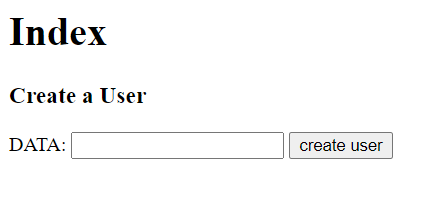
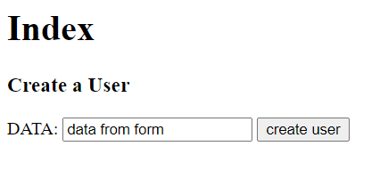
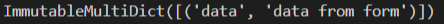

<!-- .slide:data-background="#000000" -->
---
# Day 5
<!-- .slide:data-background="#000000" -->
   <!-- .element: class="fragment" -->
---
# POST Form Submission
--
```py
from flask import Flask, render_template, request, redirect
```
--
# Posting requires TWO routes!!!!
- one for the form  <!-- .element: class="fragment" -->
- one to handle the form submission  <!-- .element: class="fragment" -->
--
```py
@app.route('/')
def index():
    return render_template("index.html")
```
<!-- .element: class="fragment" -->

```py
@app.route('/users', methods=['POST'])
def create_user():
    print(request.form)
    return redirect('/')
```
<!-- .element: class="fragment" -->
--
```html
    <form action='/users' method='post'>
       DATA: <input type='text' name='data'>
        <input type='submit' value='create user'>
    </form>
```
--

--

--

---
# Dojo Fruit Store
---
# Redirecting
---
# Session
--
--
## Session allows us to keep track of:
- Whether there is a user logged in
- Who the current user is
- What links a user has viewed previously

--
```py
from flask import Flask, render_template, request, redirect, session
```
--
```py
from flask import Flask, render_template, request, redirect, session
app = Flask(__name__)
app.secret_key = 'I am the princess of Canada' # set a secret key for security purposes
---
# Counter (Core)
---
# Great Number Game (Practice)
---
# Dojo Survey (Core)
---
# Hidden Inputs
---
# Ninja Gold (Optional)
- Python syntax is analogous to English syntax.   <!-- .element: class="fragment" -->